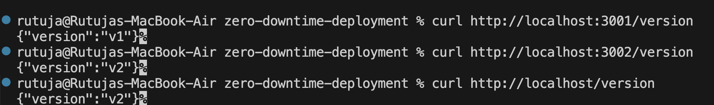
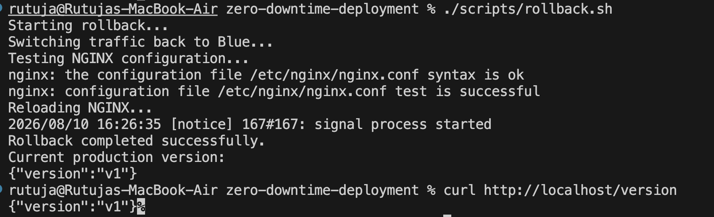

# Zero-Downtime Deployment Pipeline

A production-style CI/CD pipeline designed to deploy application updates without service interruption.

## Features

* Rolling Updates
* Blue-Green Deployment
* Automated Rollback
* Docker Containerization
* GitHub Actions CI/CD
* NGINX Reverse Proxy
* Health Checks
* Zero-Downtime Deployment

## Architecture

```text
Developer
    |
    v
GitHub Repository
    |
    v
GitHub Actions
    |
    v
Docker Build
    |
    v
NGINX
    |
    +----> Blue / Green
    |
    +----> Rolling Update
    |
    v
Application
```

## Deployment Screenshots

### Blue-Green Deployment



### Rollback



## Tech Stack

* GitHub Actions
* Docker
* NGINX
* Node.js
* JavaScript
* Bash
* Docker Compose

## Key Concepts

This project demonstrates zero-downtime deployments using containerized applications, automated CI/CD, Blue-Green deployment, rolling updates, health checks, and rollback strategies.

## Author

**Rutuja Darade**


